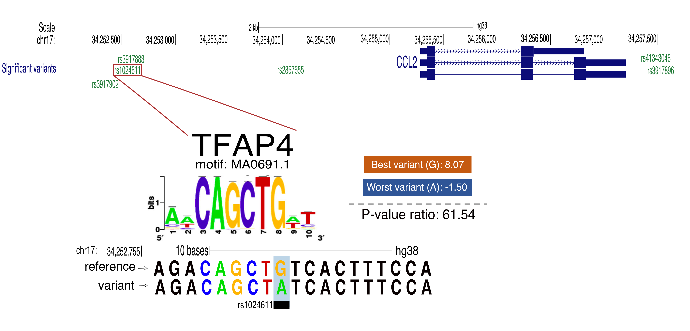

```{r setup, echo = FALSE, message = FALSE, warning = F}
knitr::opts_knit$set(root.dir = "/home/aschafer/Documentos/Genomicas/Laboratorios/RegGenoLab/Variations/COPD/")
```

```{r, echo = FALSE, message = FALSE}
# I load all the libraries that I'll be using during the project 
library(dplyr)
library(stringr)
library(ggplot2)
library(rmdformats)
library(TFBSTools)
library(JASPAR2020)
library(ggthemes)
library(ggeasy)
library(gprofiler2)
library(htmlTable)
library(magrittr)
# I'll be using this variant a lot during the whole analysis; that's why I call it here. 
JASPAR_IDs <- read.table("Data/JASPAR_IDs.txt") 
colnames(JASPAR_IDs) <- c("X.ac_motif", "TF")
GTEx_data <- read.csv("Data/GTEx_Analysis_2017-06-05_v8_RNASeQCv1.1.9_gene_median_tpm_lung_blood.csv", sep = "\t", comment.char = "#")
colnames(GTEx_data) <- GTEx_data[1,] 
GTEx_data <- GTEx_data[-1,]
UCSC_genes <- read.table("Data/GRCh38_UCSC_RefSeq_Genes")
colnames(UCSC_genes) <- c("bin", "name",	"chrom",	"strand",	"txStart",	"txEnd",	"cdsStart",	"cdsEnd",	"exonCount",	"exonStarts",	"exonEnds",	"score",	"name2",	"cdsStartStat",	"cdsEndStat",	"exonFrames")
UCSC_genes$chrom <- str_replace(UCSC_genes$chrom, "chr", "")
```         

<div style = "text-align: justify">
Chronic Obstructive Pulmonary Disease (COPD) is a lung condition characterized by breathing difficulties. Previously it was studied the gene expression profiles of this disease and published in PulmonDB database. But it was unknown which variants cause the disease, which is the main objective, where I found the variants that change the expression of the previously analyzed genes.        

To do that, I focused on retrieving the variants previously annotated for COPD genes and the disease, then analyzing them with Regulatory Sequence Analysis Tools (RSAT) to retrieve transcriptional factor motifs where the variants are affecting. Then I searched for genes close to the variants and filtered for those in a meta-analysis (realized by Ana Beatriz Villaseñor), which complemented the data from PulmonDB.      
</div>      


# Retrieve variants     

<div style = "text-align: justify">
For the variant search, I used a database created by Lucia Ramirez, which included data from the Genome-wide association study (GWAS), ClinVar, Genotype-Tissue Expression (GTEx) project, and the Single Nucleotide Polymorphism Database (dbSNP). I searched for variants that were associated with disease and genes.        
</div>

## Disease associated variants  

<div style = "text-align: justify">
I started filtering the variants related to COPD, FEV1, and FVC. Then, I created a bed file where I kept the chromosome name, the start position, and the end. I also needed a vcf file, so I also creat it here.         
</div>

```{bash, eval = F}
# I realized the filter with grep, using -E, which determines that I will be applying regular expression.       
# Also, I sorted my results with sort, using the parameters -n (so that its order in numerical order) and -k (to specify the reference column).        
grep -E "(COPD|FVC|FEV1)" Data/Gwas_Clinvar_Gtex_dbSNP_Joined.bed | sort -nk 2 | awk '{print $1 "\t" $2-1 "\t" $2}' > Data/disease-associated-variants-bed.txt
# The parameter -F "\t" from awk specifies that the delimitation of columns is by tabs. 
grep -E "(COPD|FVC|FEV1)" Data/Gwas_Clinvar_Gtex_dbSNP_Joined.bed | sort -nk 2 | awk -F"\t" '{OFS=FS}{if ($3 == "NA") $3 = $20}{if ($15 == "NA") $15 = $22}{if ($16 == "NA") $16 = $4; print}' | awk -F "\t" '{print $1 "\t" $2 "\t" $3 "\t" $15 "\t" $16 "\t" "." "\t" "." "\t" "."}' > Data/disease-associated-variants-vcf.txt
```

## Gene associated variants       

<div style = "text-align: justify">
I used a file that has [gene associations with diseases](https://deisygysi.github.io/NetMed_Workshop/data-commonly-used-in-network-medicine.html). I searched for Chronic Obstructive Airway Disease, Chronic Lung Injury, Lung Diseases Obstructive, and Pulmonary Emphysema, and in total, I ended up with 74 genes. And since I was going to be using the gene symbol to search them in the database from Luci, I created a file with the gene symbols retrieved from the file previously mentioned.         
</div>        

```{bash, eval = F}
grep -E "(C0024117|C2350344|C0600260|C0034067)" Data/curated_gene_disease_associations.tsv | awk '{print $2}' > Data/genes-symbol.txt
# In this case, I use grep with -w (retrieves variants only if the whole word matches) and -f (specifies that it will be using a file in the search), and then I create the corresponding files. 
grep -wf Data/genes-symbol.txt Data/Gwas_Clinvar_Gtex_dbSNP_Joined.bed | sort -nk 2 | awk '{print $1 "\t" $2-1 "\t" $2}' > Data/genes-associated-variants-bed.txt
grep -wf Data/genes-symbol.txt Data/Gwas_Clinvar_Gtex_dbSNP_Joined.bed | sort -nk 2 | awk -F"\t" '{OFS=FS}{if ($3 == "NA") $3 = $20}{if ($15 == "NA") $15 = $22}{if ($16 == "NA") $16 = $4; print}' | awk -F "\t" '{print $1 "\t" $2 "\t" $3 "\t" $15 "\t" $16 "\t" "." "\t" "." "\t" "."}' > Data/genes-associated-variants-vcf.txt
```         

## Variants concatenation          

<div style = "text-align: justify">
Here I concatenate all the variants retrieve from the disease and gene association variants to end up with the final vcf and bed files. Two variants were having a problem because the reference allele was in the IUPAC code, so I removed them from both files. In this step, I also put on the corresponding header in each file.        
</div> 

```{bash, eval = F}
cat Data/disease-associated-variants-bed.txt Data/genes-associated-variants-bed.txt | sort -nk 2 | uniq | sed -E '/(73405117|73420262)/d' | sed -e '1 i\chrom \t chromStar \t chromEnd' > Data/all_variants.bed
cat Data/disease-associated-variants-vcf.txt Data/genes-associated-variants-vcf.txt | sort -nk 2 | uniq | sed -E '/(73405117|73420262)/d' | awk -F"\t" '{OFS=FS}{if ($3 == "NA") $3 = $1$2; print}' |  sed -e '1 i\##fileformat=VCFv4.2\n#CHROM\tPOS\tID\tREF\tALT\tQUAL\tFILTER\tINFO' > Data/all_variants.vcf
# I removed all the gene and disease .txt temporary files that I created since I would not be using them anymore.  
ls | grep -e '^[g|d]' | xargs -r rm
# I create a file with the JASPAR TF IDs since I'll be needing this later.
grep '>' Data/JASPAR2020_CORE_vertebrates_non-redundant_pfms_jaspar.txt | tr -d '>' > Data/JASPAR_IDs.txt
```       

# Identify affected TFBS

<div style = "text-align: justify">
To identify the affected TFBS. I analyze motif changes with variation tools from Regulatory Sequence Analysis Tools (RSAT).        
First, I needed to create a background model, so I used fetch-sequences, which receives a BED file and collects the sequences from the UCSC genome browser. I chose to retrieve 100pb upstream and 100pb downstream from the variant. And then, given that sequence, I created my background model with the tool create-background-model.            
I used convert-variations to retrieve a varBed file from a VCF; this is a format from RSAT that facilitates the processing of the information of the variants. Then I used retrieve-variation-seq, which gives you the sequences surrounding the variant (30pb). Finally, I used variation-scan, which provides you with the probability of having a new instance in the sequence from the variant given the background model binding site (created before); this is done by processing different variants with the JASPAR non-redundant motif database and comparing the scores and p-values to find the TFBS that are being affected. 
</div> 

```{bash, eval = F}
rsat fetch-sequences -i Data/all_variants.bed -o Results/RSAT/all_variants_bg.fasta -v 1 -downstr_ext 100 -upstr_ext 100 -genome hg38
rsat create-background-model -v 1 -i Results/RSAT/all_variants_bg.fasta -markov 2 -out_format transitions -o Results/all_variants_bg_model.txt
rsat convert-variations -v 1 -i Data/all_variants.vcf -from vcf -to varBed -o Results/RSAT/all_variants.varBed
rsat retrieve-variation-seq -species Homo_sapiens -assembly GRCh38 -i  Results/RSAT/all_variants.varBed -format varBed -mml 30 -v 1 -o  Results/RSAT/all_variants.varSeq
rsat variation-scan -i  Results/RSAT/all_variants.varSeq -m /cm/shared/apps/rsat/rsat/public_html/motif_databases/JASPAR/Jaspar_2020/nonredundant/JASPAR2020_CORE_vertebrates_non-redundant_pfms.tf -m_format transfac -bg all_variants_bg_model.txt -o  Results/RSAT/all_variants_varScan.tsv -v 1 -mml 30 -lth score 1 -lth w_diff 1 -lth pval_ratio 10 -uth pval 1e-3
```    

<div style = "text-align: justify">          
Once I had the results from variation-Scan, I analyzed them. To do that, I filtered just the ones that fulfill quality requirements, and using the JASPAR data, I added a column with the corresponding TF from the motif. 
</div> 

```{r}
COPD_varScan <- read.csv("Results/RSAT/all_variants_varScan.tsv", header = T, sep = "\t", comment.char = ";") %>% filter(pval_ratio > 10 & (best_w == 0 | worst_w == 0 | (best_w * worst_w) < 0) & best_pval < 1e-4 ) %>% merge(JASPAR_IDs, by = "X.ac_motif", all.x = T)
COPD_varScan <- COPD_varScan[,c(1, 22, 2:21)]
```     

<div style = "text-align: justify"> 
To make sure that my variants were affecting the TF, I realized two different negative controls. One with vSampler and the other one with matrix permutations, both explained later. And I compute both of them for tissue and blood data independently.      
</div>      

## Tissue negative control   

<div style = "text-align: justify">          
For the tissue, I used the Tissue meta-analysis realized by Ana B and filtered just the TFs on the tissue data. So, from 452 unique TFs, I ended up with 354 TFs. 
</div> 

```{r}
Tissue_meta_analysis <- read.csv("Data/2021-03-01_Step6_meta-analysis.csv") 
Tissue_COPD_varScan <- COPD_varScan[COPD_varScan$TF %in% Tissue_meta_analysis$X,]
```

### vSampler
<div style = "text-align: justify">
vSampler is a tool that receives the list of variants you're using, and for each one of them retrieves random variants given eight different properties. This is used to compute a negative control.    
To use vSampler, I needed to create a file with the chromosome name and the variant's position. For that, I used only the significant ones from variationScan and created the input file.         
</div>

```{r}
Tissue_coords <- as.data.frame(matrix(unlist(str_split(unlist(str_split(unlist(str_split(Tissue_COPD_varScan$var_coord, ":")), "-")), "_")), ncol = 4, byrow = T))[,(1:2)]
write.table(Tissue_coords, file = "Data/Tissue_vSampler_Coord-Only.txt", append = F, sep = "\t", row.names = F, col.names = F, quote = F)
rm(Tissue_coords)
```      

<div style = "text-align: justify">
I ran vSampler online. And given the result list of variants, I created the vcf file and the bed file. Then, I ran all the same steps as before from RSAT-tools. 
</div>
```{bash, eval = F}
grep control1 Data/Tissue_vSampler/anno.out.txt | awk '{print $2 "\t" $3-1 "\t" $3}' | sed -e '1 i\chrom \t chromStar \t chromEnd' > Data/TissueNC_vSampler.bed
grep control1 Data/Tissue_vSampler/anno.out.txt | awk '{print $2 "\t" $3 "\t" "." "\t" $4 "\t" $5 "\t" "." "\t" "." "\t" "."}' |  sed -e '1 i\##fileformat=VCFv4.2\n#CHROM\tPOS\tID\tREF\tALT\tQUAL\tFILTER\tINFO' > Data/TissueNC_vSampler.vcf
rsat fetch-sequences -i Data/TissueNC_vSampler.bed -o Results/RSAT/TissueNC_vSampler_bg.fasta -v 1 -downstr_ext 100 -upstr_ext 100 -genome hg38
rsat create-background-model -v 1 -i Results/RSAT/TissueNC_vSampler_bg.fasta -markov 2 -out_format transitions -o Results/RSAT/TissueNC_vSampler_bg_model.txt
rsat convert-variations -v 1 -i Data/TissueNC_vSampler.vcf -from vcf -to varBed -o Results/RSAT/TissueNC_vSampler.varBed
rsat retrieve-variation-seq -species Homo_sapiens -assembly GRCh38 -i Results/RSAT/TissueNC_vSampler.varBed -format varBed -mml 30 -v 1 -o Results/RSAT/TissueNC_vSampler.varSeq
rsat variation-scan -i Results/RSAT/TissueNC_vSampler.varSeq -m /cm/shared/apps/rsat/rsat/public_html/motif_databases/JASPAR/Jaspar_2020/nonredundant/JASPAR2020_CORE_vertebrates_non-redundant_pfms.tf -m_format transfac -bg  Results/RSAT/TissueNC_vSampler_bg_model.txt -o Results/RSAT/TissueNC_vSampler_varScan.tsv -v 1 -mml 30 -lth w_diff 1 -lth pval_ratio 10 -uth pval 1e-3
```

### Matrix permutation
<div style = "text-align: justify">
I retrieved the Jaspar PFM matrix from the previously filtered TFs and then saved it into a file.        
</div>  

```{r, eval = F}
Jaspar_Tissue_PFMatrix <- getMatrixByID(JASPAR2020, ID = Tissue_COPD_varScan$X.ac_motif)
write_transfac(Jaspar_Tissue_PFMatrix, "Data/TissueNC_PFMatrix.txt", overwrite = T)
rm(Jaspar_Tissue_PFMatrix)
```      

<div style = "text-align: justify">
Again I used some tools from RSAT to perform the negative control. To do that, I created five permutations of my matrices and then ran again variation-scan with the new matrix file.
</div>  

```{bash, eval = F}
# Because the transfac format has the name of the motif in AC, in order to function I needed to correct that in the matrix file.
cat Data/TissueNC_PFMatrix.txt | sed -e  's/NA/AC/' > Data/TissueNC_PFMatrix.tf
rm Data/TissueNC_PFMatrix.txt 
rsat permute-matrix -v 0 -in_format transfac -i Data/TissueNC_PFMatrix.tf -perm 5 -out_format transfac -o Results/RSAT/TissueNC_5perm_transfac.tf
rsat variation-scan -i Results/RSAT/all_variants.varSeq -m Results/RSAT/TissueNC_5perm_transfac.tf -m_format transfac -bg Results/RSAT/all_variants_bg_model.txt -o Results/RSAT/tissueNC_5perm_varScan.tsv -v 1 -mml 30 -lth score 1 -lth w_diff 1 -lth pval_ratio 10 -uth pval 1e-3
```

### Tissue negative control distribution analysis     
<div style = "text-align: justify">
To scan both variation-scan results from both of my controls independently, I calculated the distribution of each motif's pval ratio, which is the ratio between the worst pval and the best one (the bigger the radio, the most significant it will be). Then, I saw the distribution on the control motif for each variant and kept just the significant ones.  
</div>  

```{r, echo = FALSE, message = FALSE}
wilcox_function <- function(obs2, obs_tfs2, NC){
  x <- as.numeric(unlist(obs2[11]))
  y <- NC[NC$TF == obs_tfs2, 11]
  if (length(x) > 0 && length(y) > 0){
    return(wilcox.test(x, y, exact = F, alternative = "greater")$p.value)
  }
}

distribution_analysis <- function(id, data, NC){
  obs <-data[data$var_id == id,]
  obs_tfs <- unique(unlist(obs[2]))
  return(sapply(obs_tfs, function(z){return(wilcox_function(obs[obs$TF == z,], z, NC))}))
}
```

```{r}
# I started by loading the results from variation-scan from vSampler and created the corresponding data to create the distribution. 
TissueNC_vSampler_varScan <- read.csv("Results/RSAT/TissueNC_vSampler_varScan.tsv", header = T, sep = "\t", comment.char = ";")
TissueNC_vSampler_varScan <- merge(TissueNC_vSampler_varScan, JASPAR_IDs, by = "X.ac_motif", all.x = T)
TissueNC_vSampler_varScan <- TissueNC_vSampler_varScan[,c(1, 22, 2:21)]
# I did the same with the results from variation-scan of the permutations. 
TissueNC_5perm_varScan <- read.csv("Results/RSAT/TissueNC_5perm_varScan.tsv", header = T, sep = "\t", comment.char = ";")
TissueNC_5perm_varScan$perm <- unlist(as.data.frame(matrix(unlist(str_split(TissueNC_5perm_varScan$X.ac_motif, "_")), ncol = 2, byrow = T))[2])
TissueNC_5perm_varScan$X.ac_motif <- unlist(as.data.frame(matrix(unlist(str_split(TissueNC_5perm_varScan$X.ac_motif, "_")), ncol = 2, byrow = T))[1])
TissueNC_5perm_varScan <- merge(TissueNC_5perm_varScan, JASPAR_IDs, by = "X.ac_motif", all.x = T)
TissueNC_5perm_varScan <- TissueNC_5perm_varScan[,c(1, 23, 2:22)]
# Using some functions created before I realize the distributions. 
Tissue_vSampler_distribution <- unlist(sapply(X = unique(Tissue_COPD_varScan$var_id), function(x){distribution_analysis(x, Tissue_COPD_varScan, TissueNC_vSampler_varScan)}))
Tissue_vSampler_distribution <- Tissue_vSampler_distribution[Tissue_vSampler_distribution < 0.05]
Tissue_vSampler_distribution <- cbind(as.data.frame(matrix(unlist(str_split(names(Tissue_vSampler_distribution), "\\.")), ncol = 2, byrow = T)), unlist(Tissue_vSampler_distribution))
colnames(Tissue_vSampler_distribution) <- c("var_id", "TF", "pvalue")
Tissue_perm_distribution <- unlist(sapply(X = unique(Tissue_COPD_varScan$var_id), function(x){distribution_analysis(x, Tissue_COPD_varScan, TissueNC_5perm_varScan)}))
Tissue_perm_distribution <- Tissue_perm_distribution[Tissue_perm_distribution < 0.05]
Tissue_perm_distribution <- cbind(as.data.frame(matrix(unlist(str_split(names(Tissue_perm_distribution), "\\.")), ncol = 2, byrow = T)), unlist(Tissue_perm_distribution))
colnames(Tissue_perm_distribution) <- c("var_id", "TF", "pvalue")
# Filter from my original data just the ones that were significant on the distributions given my negatives controls. 
Tissue_significant_var <- unique(rbind(Tissue_perm_distribution, Tissue_vSampler_distribution)[c("var_id", "TF")])
Tissue_significant_varScan <- merge(Tissue_significant_var, Tissue_COPD_varScan, by = c("var_id", "TF"))
Tissue_significant_varScan  <- Tissue_significant_varScan[,c(3, 2, 1, 4:22)]
rm(TissueNC_vSampler_varScan)
rm(TissueNC_5perm_varScan)
rm(Tissue_vSampler_distribution)
rm(Tissue_perm_distribution)
```     

<div style = "text-align: justify">          
In tissue, from 354 TFs, I find 315 that were being significant in my data.      
</div> 

## Blood negative control    

<div style = "text-align: justify">   
I used the blood meta-analysis realized by Ana B and filtered just the TFs on the blood data. Here I found 357 TFs.      
</div>      
```{r}
Blood_meta_analysis <- read.csv("Data/Blood_2021-03-01_Step6_meta-analysis.csv")
Blood_COPD_varScan <- COPD_varScan[COPD_varScan$TF %in% Blood_meta_analysis$X,]
``` 

### vSampler   
<div style = "text-align: justify">
Here I did the same as with the tissue data, so I created the corresponding file with the variant's position and ran vSampler online.     
</div>
```{r, eval = F}
Blood_coords <- as.data.frame(matrix(unlist(str_split(unlist(str_split(unlist(str_split(Blood_COPD_varScan$var_coord, ":")), "-")), "_")), ncol = 4, byrow = T))[,(1:2)]
write.table(Blood_coords, file = "Data/Blood_vSampler_Coord-Only.txt", append = F, sep = "\t", row.names = F, col.names = F, quote = F)
rm(Blood_coords)
```

<div style = "text-align: justify">
Given my result list of variants, I created the vcf file and the bed file. Then, I ran all the steps from RSAT-tools. 
</div>

```{bash, eval = F}
grep control1 Data/Blood_vSampler/anno.out.txt | awk '{print $2 "\t" $3-1 "\t" $3}' | sed -e '1 i\chrom \t chromStar \t chromEnd' > Data/BloodNC_vSampler.bed
grep control1 Data/Blood_vSampler/anno.out.txt | awk '{print $2 "\t" $3 "\t" "." "\t" $4 "\t" $5 "\t" "." "\t" "." "\t" "."}' |  sed -e '1 i\##fileformat=VCFv4.2\n#CHROM\tPOS\tID\tREF\tALT\tQUAL\tFILTER\tINFO' > Data/BloodNC_vSampler.vcf
rsat fetch-sequences -i Data/BloodNC_vSampler.bed -o Results/RSAT/BloodNC_vSampler_bg.fasta -v 1 -downstr_ext 100 -upstr_ext 100 -genome hg38
rsat create-background-model -v 1 -i Results/RSAT/BloodNC_vSampler_bg.fasta -markov 2 -out_format transitions -o Results/RSAT/BloodNC_vSampler_bg_model.txt
rsat convert-variations -v 1 -i Data/BloodNC_vSampler.vcf -from vcf -to varBed -o Results/RSAT/BloodNC_vSampler.varBed
rsat retrieve-variation-seq -species Homo_sapiens -assembly GRCh38 -i Results/RSAT/BloodNC_vSampler.varBed -format varBed -mml 30 -v 1 -o Results/RSAT/BloodNC_vSampler.varSeq
rsat variation-scan -i Results/RSAT/BloodNC_vSampler.varSeq -m /cm/shared/apps/rsat/rsat/public_html/motif_databases/JASPAR/Jaspar_2020/nonredundant/JASPAR2020_CORE_vertebrates_non-redundant_pfms.tf -m_format transfac -bg  Results/RSAT/BloodNC_vSampler_bg_model.txt -o Results/RSAT/BloodNC_vSampler_varScan.tsv -v 1 -mml 30 -lth w_diff 1 -lth pval_ratio 10 -uth pval 1e-3
```

### Matrix permutation
<div style = "text-align: justify">
Just as with tissue, I retrieved the Jaspar PFM matrix and then ran the corresponding tools from RSAT.       
</div>  

```{r, eval = F}
Jaspar_Blood_PFMatrix <- getMatrixByID(JASPAR2020, ID = Blood_COPD_varScan$X.ac_motif)
write_transfac(Jaspar_Blood_PFMatrix, "Data/BloodNC_PFMatrix.txt", overwrite = T)
rm(Jaspar_Blood_PFMatrix)
```  

```{bash, eval = F}
# Because the transfac format has the name of the motif in AC, in order to function I needed to correct that in the matrix file.
cat Data/BloodNC_PFMatrix.txt | sed -e  's/NA/AC/' > Data/BloodNC_PFMatrix.tf
rm Data/BloodNC_PFMatrix.txt 
rsat permute-matrix -v 0 -in_format transfac -i Data/BloodNC_PFMatrix.tf -perm 5 -out_format transfac -o Results/RSAT/BloodNC_5perm_transfac.tf
rsat variation-scan -i Results/RSAT/all_variants.varSeq -m Results/RSAT/BloodNC_5perm_transfac.tf -m_format transfac -bg Results/RSAT/all_variants_bg_model.txt -o Results/RSAT/BloodNC_5perm_varScan.tsv -v 1 -mml 30 -lth score 1 -lth w_diff 1 -lth pval_ratio 10 -uth pval 1e-3
```

### Blood negative control distribution analysis
<div style = "text-align: justify">
I ran the same functions but with my blood results to analyze the distribution on the control motif for each variant and kept just the significant ones. 
</div> 

```{r}
# I started by loading the results from variation-scan from vSampler and created the corresponding data to create the distribution. 
BloodNC_vSampler_varScan <- read.csv("Results/RSAT/BloodNC_vSampler_varScan.tsv", header = T, sep = "\t", comment.char = ";")
BloodNC_vSampler_varScan <- merge(BloodNC_vSampler_varScan, JASPAR_IDs, by = "X.ac_motif", all.x = T)
BloodNC_vSampler_varScan <- BloodNC_vSampler_varScan[,c(1, 22, 2:21)]
# I did the same with the results from variation-scan of the permutations. 
BloodNC_5perm_varScan <- read.csv("Results/RSAT/BloodNC_5perm_varScan.tsv", header = T, sep = "\t", comment.char = ";")
BloodNC_5perm_varScan$perm <- unlist(as.data.frame(matrix(unlist(str_split(BloodNC_5perm_varScan$X.ac_motif, "_")), ncol = 2, byrow = T))[2])
BloodNC_5perm_varScan$X.ac_motif <- unlist(as.data.frame(matrix(unlist(str_split(BloodNC_5perm_varScan$X.ac_motif, "_")), ncol = 2, byrow = T))[1])
BloodNC_5perm_varScan <- merge(BloodNC_5perm_varScan, JASPAR_IDs, by = "X.ac_motif", all.x = T)
BloodNC_5perm_varScan <- BloodNC_5perm_varScan[,c(1, 23, 2:22)]
# Using some functions created before I realize the distributions. 
Blood_vSampler_distribution <- unlist(sapply(X = unique(Blood_COPD_varScan$var_id), function(x){distribution_analysis(x, Blood_COPD_varScan, BloodNC_vSampler_varScan)}))
Blood_vSampler_distribution <- Blood_vSampler_distribution[Blood_vSampler_distribution < 0.05]
Blood_vSampler_distribution <- cbind(as.data.frame(matrix(unlist(str_split(names(Blood_vSampler_distribution), "\\.")), ncol = 2, byrow = T)), unlist(Blood_vSampler_distribution))
colnames(Blood_vSampler_distribution) <- c("var_id", "TF", "pvalue")
Blood_perm_distribution <- unlist(sapply(X = unique(Blood_COPD_varScan$var_id), function(x){distribution_analysis(x, Blood_COPD_varScan, BloodNC_5perm_varScan)}))
Blood_perm_distribution <- Blood_perm_distribution[Blood_perm_distribution < 0.05]
Blood_perm_distribution <- cbind(as.data.frame(matrix(unlist(str_split(names(Blood_perm_distribution), "\\.")), ncol = 2, byrow = T)), unlist(Blood_perm_distribution))
colnames(Blood_perm_distribution) <- c("var_id", "TF", "pvalue")
# Filter from my original data just the ones that were significant on the distributions given my negatives controls. 
Blood_significant_var <- unique(rbind(Blood_perm_distribution, Blood_vSampler_distribution)[c("var_id", "TF")])
Blood_significant_varScan <- merge(Blood_significant_var, Blood_COPD_varScan, by = c("var_id", "TF"))
Blood_significant_varScan  <- Blood_significant_varScan[,c(3, 2, 1, 4:22)]
rm(BloodNC_vSampler_varScan)
rm(BloodNC_5perm_varScan)
rm(Blood_vSampler_distribution)
rm(Blood_perm_distribution)
```     

<div style = "text-align: justify">          
In this case, from 357 TFs, I find 311 that were being significant in my data.  
</div> 

# Gene association 
<div style="text-align: justify">
Given my results I associated each variant with the closest gene given the meta-analysis realized by Ana B.
</div> 

<div style="text-align: justify">
I'll be using the Transcripts per Million (TPM) from the Genotype-Tissue Expression (GTEx) to select just the TFs that are active in normal conditions. So the next code is to select the data that I'll be using later on. 
</div> 

```{bash, eval = F}
awk -F "\t" '{print $1 "\t" $2 "\t" $39 "\t" $56}' GTEx_Analysis_2017-06-05_v8_RNASeQCv1.1.9_gene_median_tpm.gct > GTEx_Analysis_2017-06-05_v8_RNASeQCv1.1.9_gene_median_tpm_lung_blood.csv
```

## Variant Effect Predictor
<div style="text-align: justify">
To do the gene search I used Ensembl Variant Effect Predictor (VEP) from ensembl and I looked for 5000 pb upstream and 1000 pb downstream from the variant.         
</div>

```{r, eval = F}
# Here I create a file with the variant id so that I can create a vcf file just with the variants that I'll be using for my tissue and blood data. 
write.table(unique(Tissue_significant_varScan$var_id), "Results/Tissue_significant_varID_varScan.txt", sep = "\t", quote = F, col.names = F, row.names = F)
# grep -wf Results/Tissue_significant_varID_varScan.txt Data/all_variants.vcf > Results/Tissue_significant_varID_varScan.vcf
write.table(unique(Blood_significant_varScan$var_id), "Results/Blood_significant_varID_varScan.txt", sep = "\t", quote = F, col.names = F, row.names = F)
# grep -wf Results/Blood_significant_varID_varScan.txt Data/all_variants.vcf > Results/Blood_significant_varID_varScan.vcf
```

I ran VEP online and download my results in R. 

### Tissue VEP results
<div style="text-align: justify">
To know if the effect is really happening between the genes and the TFs, I search in GTEx the Transcripts Per Million (TPM) of lung and blood and remove all the genes and TFs that had a TPM of 0, from my results of VEP.   
</div>

```{r}
Tissue_VEP <- read.csv("Results/Tissue_VEP.txt", sep = "\t")
Tissue_meta_analysis_f <- filter(Tissue_meta_analysis, qval.random <= 0.05 & I2 < 0.4 & num_exp >= 9)
Tissue_VEP <- Tissue_VEP[Tissue_VEP$SYMBOL %in% Tissue_meta_analysis_f$X,]
Tissue_data <- merge(data.frame(merge(Tissue_meta_analysis, Tissue_VEP, by.x = "X", by.y = "SYMBOL" )), Tissue_significant_varScan, by.x = "X.Uploaded_variation", by.y = "var_id")
Tissue_data$TF.TE.random <- sapply(Tissue_data$TF, function(x){return(filter(Tissue_meta_analysis, X == x)$TE.random)})
Tissue_data <- Tissue_data[,c(1, 59, 53, 50, 51, 71, 2, 9, 3, 5, 6, 12:14, 19, 20, 29, 41)]
Tissue_data <- unique(Tissue_data)
colnames(Tissue_data) <- c("var_id", "varScan_pval.ratio", "var_coord", "motif", "TF", "TF_TE.random", "gene", "gene_qval.random", "gene_TE.random", "gene_tau2", "gene_I2", "ALT", "Consequence", "IMPACT", "EXON", "INTRON", "DISTANCE", "CLIN_SIG")
Tissue_data <- Tissue_data[c(3:6, 8:9, 14),]
# GTEx filter
GTEx_tissue_data <- rbind(GTEx_data[GTEx_data$Description %in% Tissue_data$TF,], GTEx_data[GTEx_data$Description %in% Tissue_data$gene,])
Tissue_data <- Tissue_data[Tissue_data$TF %in% GTEx_tissue_data[GTEx_tissue_data$Lung != 0,]$Description,]
Tissue_data <- Tissue_data[Tissue_data$gene %in% GTEx_tissue_data[GTEx_tissue_data$Lung != 0,]$Description,]
Tissue_data %>% htmlTable
```
### Figure 2     


### Blood VEP results
<div style="text-align: justify">
I did the same for my blood results. Since I got a huge list from VEP that were positive, I did an extra filter. So, I looked for the coordinates of the genes from UCSC genome browser and assure that the gene was between my variant. Doing this filter helped me to remove the ones that weren't close to the gene. 
</div>

```{r}
Blood_VEP <- read.csv("Results/Blood_VEP.txt", sep = "\t")
Blood_meta_analysis_f <- filter(Blood_meta_analysis, qval.random <= 0.05 & I2 < 0.4 & num_exp >= 4)
Blood_VEP <- Blood_VEP[Blood_VEP$SYMBOL %in% Blood_meta_analysis_f$X,]
Blood_data <- merge(data.frame(merge(Blood_meta_analysis, Blood_VEP, by.x = "X", by.y = "SYMBOL" )), Blood_significant_varScan, by.x = "X.Uploaded_variation", by.y = "var_id")
Blood_data$TF.TE.random <- sapply(Blood_data$TF, function(x){return(filter(Blood_meta_analysis, X == x)$TE.random)})
Blood_data <- Blood_data[,c(1, 59, 53, 50, 51, 71, 2, 9, 3, 5, 6, 12:14, 19, 20, 29, 41)]
Blood_data <- unique(Blood_data)
colnames(Blood_data) <- c("var_id", "varScan_pval.ratio", "var_coord", "motif", "TF", "TF_TE.random", "gene", "gene_qval.random", "gene_TE.random", "gene_tau2", "gene_I2", "ALT", "Consequence", "IMPACT", "EXON", "INTRON", "DISTANCE", "CLIN_SIG")
# UCSC filter
Blood_UCSC_genes <- UCSC_genes[UCSC_genes$name2 %in% Blood_meta_analysis_f$X,]
Blood_varScan_coord <- as.data.frame(matrix(unlist(str_split(unlist(str_split(unlist(str_split(Blood_significant_varScan$var_coord, ":")), "-")), "_")), ncol = 4, byrow = T)) 
Blood_genes <- unique(unlist(sapply(c(1:nrow(Blood_significant_varScan)), function(x){return(filter(Blood_UCSC_genes, (chrom == Blood_varScan_coord$V1[x]) & ((cdsStart-5000) <= Blood_varScan_coord$V2[x]) & ((cdsEnd+5000) >= Blood_varScan_coord$V3[x]))$name2)})))
Blood_data <- Blood_data[Blood_data$gene %in% Blood_genes,]
# GTEx filter
GTEx_blood_data <- rbind(GTEx_data[GTEx_data$Description %in% Blood_data$TF,], GTEx_data[GTEx_data$Description %in% Blood_data$gene,])
Blood_data <- Blood_data[Blood_data$TF %in% GTEx_blood_data[GTEx_blood_data$`Whole Blood` != 0,]$Description,]
Blood_data <- Blood_data[Blood_data$gene %in% GTEx_blood_data[GTEx_blood_data$`Whole Blood` != 0,]$Description,]
head(Tissue_data) %>% htmlTable
```

### Figure 3     


## Result analysis
<div style="text-align: justify">
Now that I have all the results, I'm going to be doing the final tables to be able to interpret my results better. To do that I'll start with some tables that will have different information all together and then some figures with the best association. 
</div>

### Variants and TFs for each gene (Table 1)     

```{r}
gene_variants_tfs_function <- function(x, data, s){
  gene_data <- data %>% filter(gene == x)
  return(c(x, toString(unique(gene_data$var_id)), toString(unique(gene_data$TF)), s))
}
gene_variants_tfs <- rbind(as.data.frame(t(sapply(X = unique(Tissue_data$gene), function(x){return(gene_variants_tfs_function(x, Tissue_data, "tissue"))}))), as.data.frame(t(sapply(X = unique(Blood_data$gene), function(x){return(gene_variants_tfs_function(x, Blood_data, "blood"))}))))
rownames(gene_variants_tfs) <- NULL
colnames(gene_variants_tfs) <- c("gene", "variants", "analysis")
write.table(gene_variants_tfs, file = "Results/Tables/Gene_variants_tfs.csv", row.names = F, quote = F, sep = "\t")
head(gene_variants_tfs) %>% htmlTable
```

### variant, gene and TFs association (Table 2)     

```{r}
variant_gene_tf <- rbind(cbind(unique(Tissue_data[,c(1, 5, 6, 7, 9)]), analysis = rep("tissue", times = 6)), cbind(unique(Blood_data[,c(1, 5, 6, 7, 9)]), analysis = rep("blood", times = 333)))
write.table(variant_gene_tf, file = "./Results/Tables/Variant_gene_tf.csv", row.names = F, quote = F, sep = "\t")
head(variant_gene_tf) %>% htmlTable()
```

### TP53 data

```{r}
TP53_consequences <-as.factor(filter(Blood_data, gene == "TP53")$Consequence)
TP53_function <- function(x, datas){
  return(c(x, nrow(filter(datas, Consequence == x)), length(unique(filter(datas, Consequence == x)$TF)), length(unique(filter(datas, Consequence == x)$var_id))))
}

TP53_data <- unique(filter(Blood_data, gene == "TP53")[,c(1, 5, 13)]) 
TP53_consequences <- as.data.frame(base::table(unlist(TP53_data$Consequence)))
TP53_other <- TP53_data[TP53_data$Consequence %in% unlist(TP53_consequences[TP53_consequences$Freq < 5,]$Var1),]
TP53_other <- data.frame(Consequence = "other", num_consequence = nrow(TP53_other), num_TFs = length(unique(TP53_other$TF)), num_var = length(unique(TP53_other$var_id)))
TP53_NoOther <- TP53_data[!TP53_data$Consequence %in% unlist(TP53_consequences[TP53_consequences$Freq < 5,]$Var1),]
TP53_NoOther <- as.data.frame(t(sapply(X = unique(TP53_NoOther$Consequence), function(x){TP53_function(x, TP53_NoOther)})))
colnames(TP53_NoOther) <- c("Consequence", "num_consequence", "num_TFs", "num_var")
TP53_consequences <- rbind(TP53_NoOther, TP53_other)
TP53_consequences <- data.frame(consequence = rep(TP53_consequences$Consequence, each = 3), num = rep(c("num_consequence", "num_TFs", "num_var"), times = nrow(TP53_consequences)), value = as.numeric(unlist(t(TP53_consequences[c(2:4)]))))
ggsave( filename = "./Results/Plots/TP53_consequences.png",
ggplot(data=TP53_consequences, aes(x = reorder(consequence, value), y=value, fill=num)) +
    geom_bar(stat="identity", position=position_dodge()) + theme(axis.text.y = element_text(size = 8)) + coord_flip() + labs(title = "TP53 consequences", y = "Appearances", x ="Consequence")
)
```     


### FAM13A article

We found this article "Identification of Functional Variants in the FAM13A Chronic Obstructive Pulmonary Disease Genome-Wide Association Study Locus by Massively Parallel Reporter Assays", where they have 3 different suplementary tables, so I check which variants from this tables we had in common.

Table E1: SNPs with significant expression-regulating effects in MPRA assay.
Table E2: SNPs with significant allele-specific expression in MPRA.
Table E3: Conditional analysis on 45 MPRA SNPs.

```{r, echo = FALSE, message = FALSE, eval = F}
library(VennDiagram)
table1_var <- unique(unlist(read.csv("./FAM13A_paper/table1_var.csv", col.names = F)))
table2_var <- unique(unlist(read.csv("./FAM13A_paper/table2_var.csv", col.names = F)))
table3_var <- unique(unlist(read.csv("./FAM13A_paper/table3_var.csv", col.names = F)))
COPD_var <- unique(COPD_varScan$var_id)
Blood_var <- Blood_data$var_id
Tissue_var <- Tissue_data$var_id

venn.diagram(x = list(table1_var, COPD_var, Blood_var), category.names = c("Table1", "VarScan", "Blood"), filename = "./FAM13A_paper/variantes_table1.png", output = T, fontface = "bold", fill = c("palegreen", "lightskyblue2", "thistle1"),  lty = 'blank', cat.fontface = "bold")

venn.diagram(x = list(table2_var, COPD_var, Blood_var), category.names = c("Table2", "VarScan", "Blood"), filename = "./FAM13A_paper/variantes_table2.png", output = T, fontface = "bold", fill = c("palegreen", "lightskyblue2", "thistle1"),  lty = 'blank', cat.fontface = "bold")

venn.diagram(x = list(table3_var, COPD_var, Blood_var), category.names = c("Table3", "VarScan", "Blood"), filename = "./FAM13A_paper/variantes_table3.png", output = T, fontface = "bold", fill = c("palegreen", "lightskyblue2", "thistle1"),  lty = 'blank', cat.fontface = "bold")
```

Significative variants that are in table 1, that are also in our blood data (from tissue there weren't any junction) :       
rs2609280 
rs2904259
rs4505789
rs7687539*
rs7695177*

Significant variants on table 2 that are in our blood data:         
rs7687539
rs7695177

Significant variants on table 2 that are in our blood data:         
rs7687539
rs76951777


### Circos

```{r}
Tissue_genes <- UCSC_genes[UCSC_genes$name2 %in% Tissue_data$gene,]
Tissue_genes <- merge(Tissue_genes, Tissue_data, by.x = "name2", by.y = "gene")
Tissue_genes <- Tissue_genes[c(1, 4, 8, 10, 11),c(4, 6, 7, 24, 1)]
Tissue_genes$chrom <- paste("hs", Tissue_genes$chrom, sep = "")
Tissue_genes$name2 <- paste("id", Tissue_genes$name2, sep = "=")
Tissue_genes$col <- "fill_color=blue"

Blood_genes <- UCSC_genes[UCSC_genes$name2 %in% Blood_data$gene,]
Blood_genes <- merge(Blood_genes, Blood_data, by.x = "name2", by.y = "gene")
Blood_genes <- unique(Blood_genes[,c(4, 6, 7, 24, 1)])[c(3, 5, 7, 9, 10, 12, 13, 19, 27, 28, 32, 34, 40, 41, 47),]
Blood_genes$chrom <- paste("hs", Blood_genes$chrom, sep = "")
Blood_genes$name2 <- paste("id", Blood_genes$name2, sep = "=")
Blood_genes$col <- "fill_color=red"

write.table(rbind(Tissue_genes, Blood_genes)[,c(1:5)], file = "segdup.genes.hist.txt", col.names = F, row.names = F, sep = " ", quote = F)
```

```{r}
Tissue_meta_genes <- UCSC_genes[UCSC_genes$name2 %in% Tissue_meta_analysis_f$X,]
Tissue_meta_genes <- Tissue_meta_genes[,c(3, 5, 6, 13)] %>% distinct(name2, .keep_all = TRUE)
Tissue_meta_genes$chrom <- paste("hs", Tissue_meta_genes$chrom, sep = "")
Tissue_meta_genes$name2 <- paste("id", Tissue_meta_genes$name2, sep = "=")

Blood_meta_genes <- UCSC_genes[UCSC_genes$name2 %in% Blood_meta_analysis_f$X,]
Blood_meta_genes <- Blood_meta_genes[,c(3, 5, 6, 13)] %>% distinct(name2, .keep_all = TRUE)
Blood_meta_genes$chrom <- paste("hs", Blood_meta_genes$chrom, sep = "")
Blood_meta_genes$name2 <- paste("id", Blood_meta_genes$name2, sep = "=")

write.table(rbind(Tissue_meta_genes, Blood_meta_genes), file = "segdup.meta.genes.hist.txt", col.names = F, row.names = F, sep = " ", quote = F)
```


